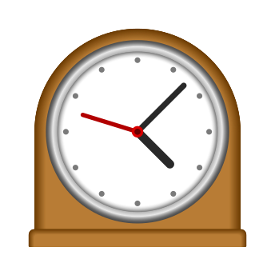
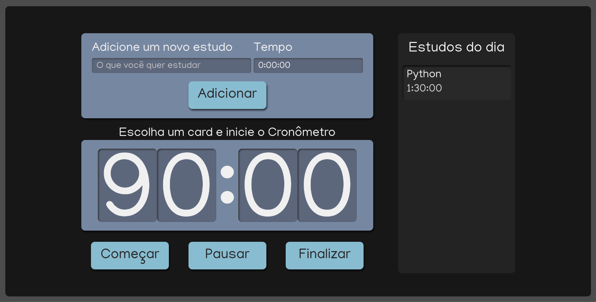

<h1 align="center">
    <a href="https://tasksclock-andre23arruda.vercel.app" target="_blank">
        
    </a>
</h1>

<h4 align="center">
  Tasks Clock
</h4>


<p align="center">
  <a href="#-tecnologias">Tecnologias</a>&nbsp;&nbsp;&nbsp;|&nbsp;&nbsp;&nbsp;
  <a href="#-projeto">Projeto</a>&nbsp;&nbsp;&nbsp;|&nbsp;&nbsp;&nbsp;
  <a href="#instalação">Instalação</a>&nbsp;&nbsp;&nbsp;|&nbsp;&nbsp;&nbsp;
  <a href="#telas">Telas</a>&nbsp;&nbsp;&nbsp;|&nbsp;&nbsp;&nbsp;
  <a href="#exemplo">Exemplo</a>
</p>


## 🚀 Tecnologias

Esse projeto foi desenvolvido com as seguintes tecnologias:

- [React](https://reactjs.org/)
- [Typescript](https://www.typescriptlang.org/)


## 💻 Projeto
**Tasks Clock é uma aplicação para você dominar o tempo sobre suas atividades. Basicamente, um cronômetros para suas tasks!!**

## Instalação
### Pré requisitos
Ter instalado:
- [Node](https://nodejs.org/en/download/)
- [Yarn](https://classic.yarnpkg.com/en/docs/install/)

```sh
# Clonar repositório
git clone https://github.com/andre23arruda/tasks-clock.git

# Instalar os pacotes do projeto
yarn install

# Run
yarn dev
```

## Telas
<div align="center">
    
</div>
<p align="center">Clock</p>
<hr>

## Exemplo
<a href="https://tasksclock-andre23arruda.vercel.app" target="_blank">Visitar</a>
